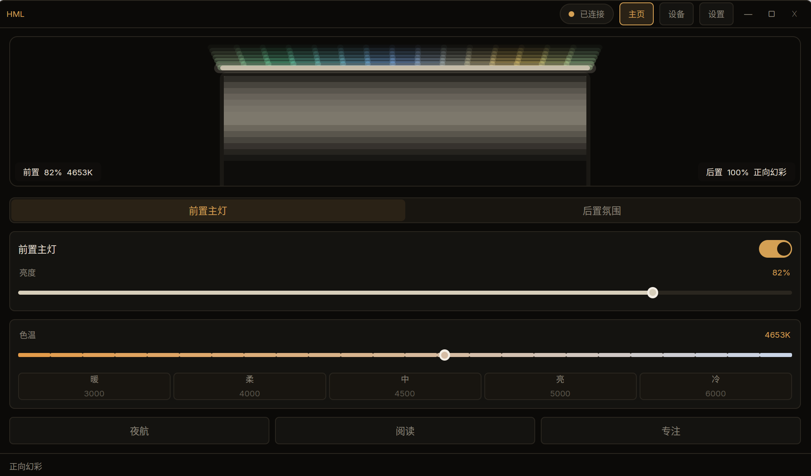

# Hi My Light

这是朋友送我的屏幕挂灯，明明有蓝牙，却只有一个难看的手机app控制

我一怒之下怒了一下，做了这个，给自己用

型号是 
- 雷神屏幕挂灯 L2 
- THUNDEROBOT L2

如果你也是相同设备的话，那就一起用一下吧




# 使用方法

我只给我要用的系统编译和适配了：
- Windows amd64
- Linux amd64 Wayland KDE

## 安装，任选其一方法

### 通用安装方法

从 GitHub Release 下载对应系统的版本，放到自己喜欢的目录，双击打开，连接设备，成功后，点击设置

设置里面有一个安装，点击即可

### Linux amd64

在想要安装的目录打开终端运行以下命令

```bash
curl -fsSL https://raw.githubusercontent.com/ThriceCola/hi-my-light/main/install.sh | bash
```

### Windows amd64

在想要安装的目录使用 PowerShell 运行以下命令

```powershell
irm https://raw.githubusercontent.com/ThriceCola/hi-my-light/main/install.ps1 | iex
```

# 声明

- 本项目仅供 学习、研究与技术交流，严禁用于任何商业、违法场景。
